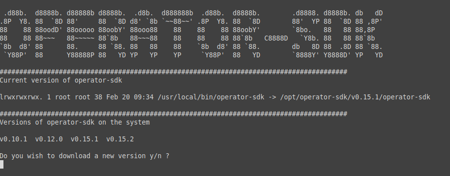

# Change the Operator-sdk binary

Shell script for downloading an changeing the operator-sdk binary so you can manage mutliple binarys locally.  Symlinking to `/usr/local/bin/opeator-sdk` from `/opt/operator-sdk/<version>/operator-sdk`. Should work with linux and Mac

> *NOTE*: This script doesn't verify the operator-sdk binary. Haven't tested on Mac.

# Usasge

```sh
# Clone the Repo
git clone https://github.com/austincunningham/change-operator-sdk.git
# change directory 
cd change-operator-sdk
# Set the file to be able to execute
chmod +x choperator-sdk.sh 
# Run the script
./choperator-sdk.sh
# If you have versions of the operator-sdk on the system installed by this tool you can pass it in with cmd line args
./choperator-sdk.sh v1.12.0
```


